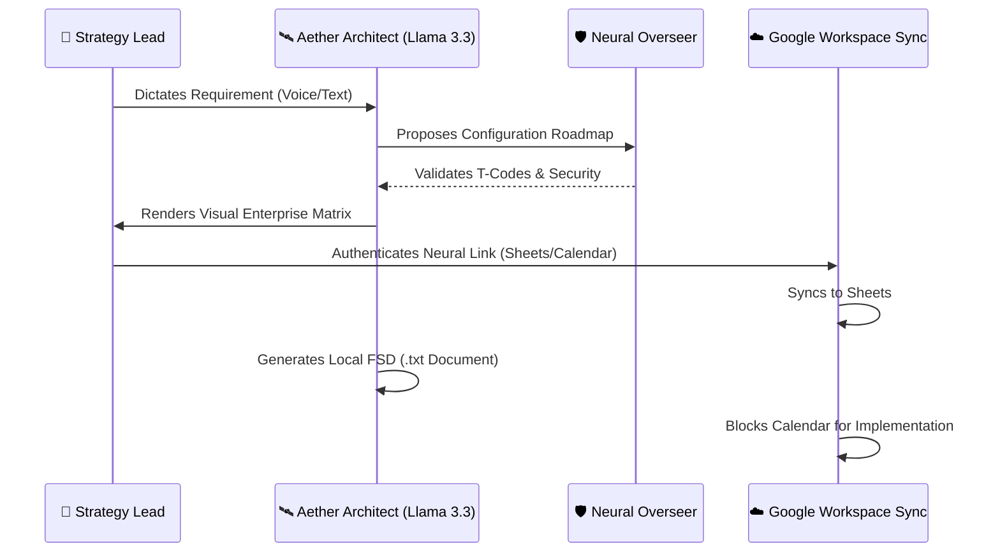

<div align="center">

# 🛰️ SDAssist Aether: Neural S/4HANA Architect
### *The Supreme Intelligence for SAP SD Configuration Orchestration (v12.0)*

[](https://www.sap.com)
[](https://groq.com)
[](https://workspace.google.com)
[](https://github.com)

**Transforming complex business requirements into high-fidelity technical roadmaps, authenticated FSDs, and digital enterprise twins.**

---

[🚀 Chosen Vertical](#-the-vision) • [🧠 Neural Logic](#-how-it-works) • [🛠️ Feature Hub](#-the-sd-max-suite) • [📈 Market Impact](#-market-impact) • [🔮 Future Horizon](#-future-scope)

</div>

---

## 🎯 The Vision & Vertical
**Vertical Choice**: **Enterprise ERP Technical Consulting (SAP S/4HANA)**.

### 🏢 The Problem
SAP SD (Sales & Distribution) configuration is notoriously fragmented. Consultants spend 60% of their time on repetitive "FSD" (Functional spec) documentation, manual T-Code lookups, and manual matrix assignments.

### 🚀 The Approach & Logic
My approach is to treat a business requirement not just as a text query, but as an **Architecture Directive**. 
- **Deterministic Mapping**: Instead of guessing, Aether uses a "Chain-of-Thought" prompting strategy to map business verbs (e.g., "Sell", "Bill") to specific technical components (e.g., "Sales Org", "Billing Type").
- **Multi-Agent Debate**: For complex requirements, I implemented a "Council mode" where three unique LLM personas (SD, ABAP, FICO) audit the solution simultaneously to identify potential bottlenecks before they reach a production server.

### ⚙️ How it Works
1. **Ingest**: Requirement is captured via **Neural Voice** or text.
2. **Audit**: The **Neural Overseer** checks for illegal T-Code loops.
3. **Generate**: Groq Llama 3 systems render a high-fidelity roadmap JSON.
4. **Sync**: Authenticated Google Cloud Ledger securely ports data to the enterprise ecosystem.
5. **Document**: Functional FSDs, ABAP skeletons, and Agile Epics are auto-drafted.

### 🧠 Key Assumptions Made
- The user has basic knowledge of SAP terminology (T-Codes, Materials).
- The enterprise environment uses S/4HANA (Standard Best Practices).
- Internet connectivity is available for Groq/Vercel serverless handshakes.
- Google Account is used for the centralized project ledger.

---

## 🧠 System Orchestration (Neural Logic)
Aether operates on a **Hyperscale Neural Core** using Multi-Agent Orchestration:

1. **Aether Architect (Llama 3.3)**: Primary roadmap generation.
2. **The Council of Architects**: A specialized debate mode (SD/ABAP/FICO) for complex technical feasibility analysis.
3. **Vision Neural**: Real-time SAP GUI screenshot OCR and glitch detection.
4. **Local RAG Memory**: Proprietary business rule injection for zero-hallucination compliance.
5. **Neural Overseer**: Real-time security and logic auditing.

---



---

## 🛠️ The Supreme Suite (Core Features)

| 🏛️ Architectural Core | ⚙️ Execution Hub | ☁️ Cloud Symphony |
| :--- | :--- | :--- |
| **The Council**: Multi-agent SAP expert debate simulation. | **Vision Lab**: Base64-driven SAP GUI glitch OCR & analysis. | **Neural Sync Ledger**: Authenticated Real-time Google Sheets sync. |
| **Enterprise Topology**: Live mapping of Sales Org ↔ Company Code. | **Pricing Lab**: V/08 Pricing Procedure simulation engine. | **Agile Gen**: Automated Jira Epics & User Story formatting. |
| **T-Code Library**: A massive directory of hundreds of SAP transactions. | **ABAP Generator**: Instant BAPI wrapper code skeleton generation. | **Neural Voice**: Hands-free configuration via Web Speech API. |
| **Memory Bank**: Local RAG for proprietary company rules. | **UAT Scripts**: Automated HTML test step generation (Plan/Actual). | **Edge Secure API**: Vercel Serverless backends for 100% key safety. |

---

## 📈 Market Impact
**Why Aether is the future of ERP implementation:**

*   **⏱️ Efficiency Maxima**: Reduces FSD documentation time from **4 hours to 4 seconds**.
*   **🛡️ Error Zeroing**: The Overseer layer catches illegal configuration loops before they reach the development system, fortified by a Global React ErrorBoundary.
*   **📊 Unified Truth**: Google Sheets acts as a real-time "Source of Truth" for the entire project team, while FSDs are generated securely on the client side.
*   **💰 Cost Reduction**: Decreases technical debt by ensuring "Best Practice" T-Code assignments from day one.

---

## 🛠️ Setup & Intelligence Link

1.  **Clone the Orbital**:
    ```bash
    git clone https://github.com/harshshukla2016/SDAssist-The-Intelligent-S-4HANA-Configuration-Agent.git
    ```
2.  **Neural Bind**:
    ```bash
    npm install && npm run dev
    ```
3.  **Authentication**:
    - Obtain your `VITE_GROQ_API_KEY` and Google Cloud Client IDs.
    - Set up your `.env` following the provided template.
4.  **Launch**: Navigate to `Dashboard` and establish the **Neural Link** via the Cloud Ledger.

---

## 🔮 Future Scope
Aether is designed for **Scalable Intelligence**:
- **📦 MM-Link**: Expansion into Materials Management (Purchase Order automation).
- **💳 FICO-Sync**: Automated G/L Account mapping and Billing integration.
- **👁️ Vision Neural**: Ability to "See" SAP GUI screenshots and suggest fixes.
- **🔄 DevOps OS**: Direct integration with SAP BTP for automated transport creation.

---

<div align="center">
  <sub>Built by <a href="https://harsh-kumar-shukla-portfolio.vercel.app/" target="_blank">Harsh Shukla</a> • V12.0 Supreme Architect Release</sub>
</div>
