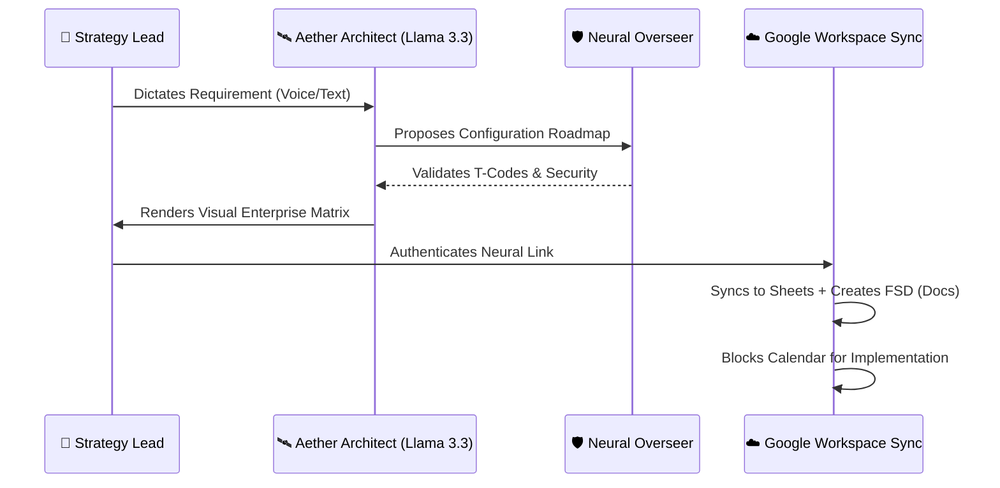

<div align="center">

# 🛰️ SDAssist Aether: Neural S/4HANA Architect
### *The Supreme Intelligence for SAP SD Configuration Orchestration*

[](https://www.sap.com)
[](https://groq.com)
[](https://workspace.google.com)
[](https://github.com)

**Transforming complex business requirements into high-fidelity technical roadmaps, authenticated FSDs, and digital enterprise twins.**

---

[🚀 Chosen Vertical](#-the-vision) • [🧠 Neural Logic](#-how-it-works) • [🛠️ Feature Hub](#-the-sd-max-suite) • [📈 Market Impact](#-market-impact) • [🔮 Future Horizon](#-future-scope)

</div>

---

## 🎯 The Vision & Vertical
**Sector**: Enterprise ERP Technical Consulting (SAP S/4HANA).
**Problem**: SAP SD (Sales & Distribution) configuration is notoriously fragmented. Consultants spend 60% of their time on repetitive "FSD" (Functional spec) documentation and manual matrix assignments.
**Solution**: **Aether OS** – A multi-agent ecosystem that acts as a "Digital Twin" of an SAP Consultant, automating the entire configuration lifecycle from voice requirement to Google Workspace artifact.

---

## 🧠 System Orchestration (Neural Logic)
Aether operates on a **Tri-Agent Neural Core** that mirrors a professional consulting team:



---

## 🛠️ The SD-Max Suite (Core Features)

| 🏛️ Architectural Core | ⚙️ Execution Hub | ☁️ Cloud Symphony |
| :--- | :--- | :--- |
| **Neural Architect**: Transforms raw speech into S/4HANA T-Code roadmaps. | **O2C Flow Visualizer**: Graphical mapping of the VA01 ↔ VF01 lifecycle. | **Neural Sync Ledger**: Authenticated Real-time Google Sheets database. |
| **Enterprise Topology**: Live mapping of Sales Org ↔ Company Code ↔ Plant. | **Pricing Lab**: Technical simulation of the V/08 Pricing Procedure table. | **Workspace FSD Gen**: Automated Google Docs Functional Specification creation. |
| **Overseer Safety**: Real-time audit layer for T-Code loops and security. | **Predictive Scheduler**: AI-driven Google Calendar slot blocking. | **Neural Voice**: Hands-free configuration via Web Speech API. |

---

## 📈 Market Impact
**Why Aether is the future of ERP implementation:**

*   **⏱️ Efficiency Maxima**: Reduces FSD documentation time from **4 hours to 4 seconds**.
*   **🛡️ Error Zeroing**: The Overseer layer catches illegal configuration loops before they reach the development system.
*   **📊 Unified Truth**: Google Sheets acts as a real-time "Source of Truth" for the entire project team, updated instantly by the AI.
*   **💰 Cost Reduction**: Decreases technical debt by ensuring "Best Practice" T-Code assignments from day one.

---

## 🛠️ Setup & Intelligence Link

1.  **Clone the Orbital**:
    ```bash
    git clone https://github.com/harshshukla2016/SDAssist-The-Intelligent-S-4HANA-Configuration-Agent.git
    ```
2.  **Neural Bind**:
    ```bash
    npm install && npm run dev
    ```
3.  **Authentication**:
    - Obtain your `VITE_GROQ_API_KEY` and Google Cloud Client IDs.
    - Set up your `.env` following the provided template.
4.  **Launch**: Navigate to `Dashboard` and establish the **Neural Link** via the Cloud Ledger.

---

## 🔮 Future Scope
Aether is designed for **Scalable Intelligence**:
- **📦 MM-Link**: Expansion into Materials Management (Purchase Order automation).
- **💳 FICO-Sync**: Automated G/L Account mapping and Billing integration.
- **👁️ Vision Neural**: Ability to "See" SAP GUI screenshots and suggest fixes.
- **🔄 DevOps OS**: Direct integration with SAP BTP for automated transport creation.

---

<div align="center">
  <sub>Built by <a href="https://harsh-kumar-shukla-portfolio.vercel.app/" target="_blank">Harsh Shukla</a> • V9.6 High-Fidelity Release</sub>
</div>
